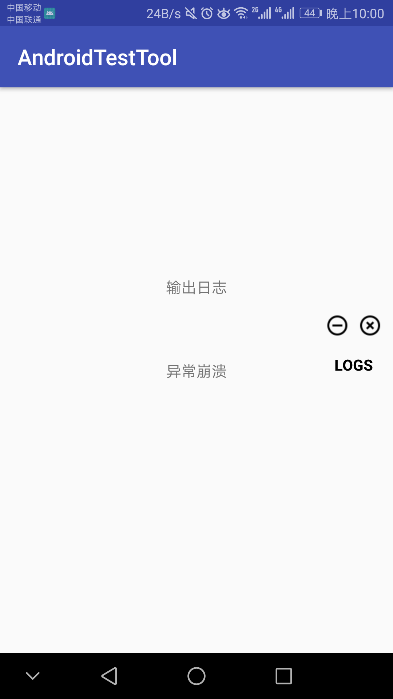
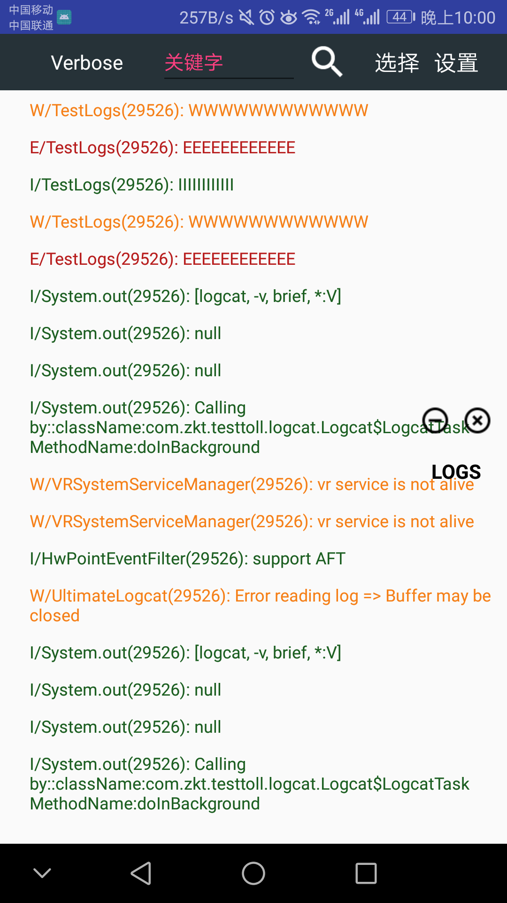
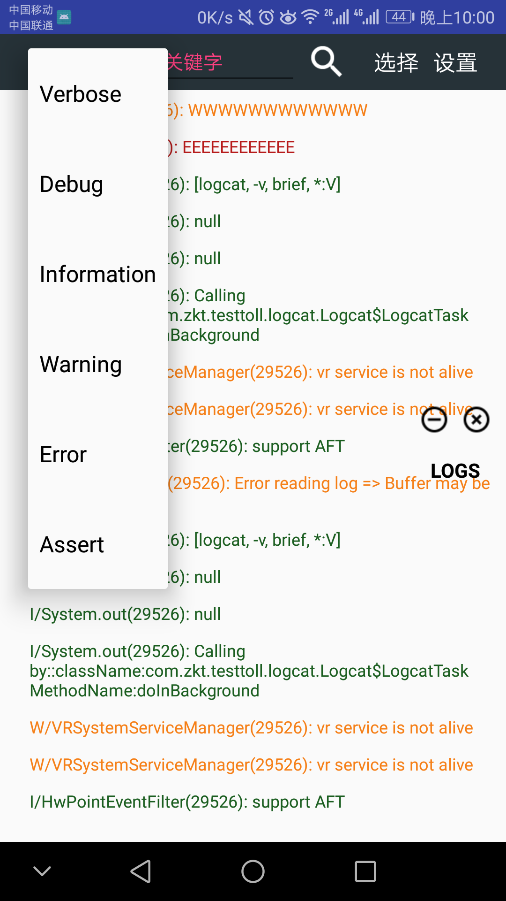
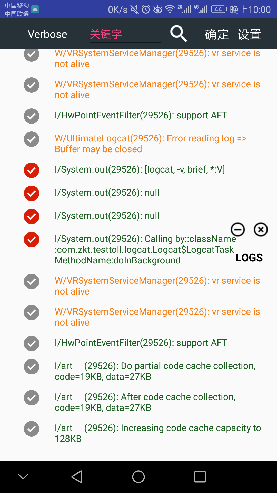
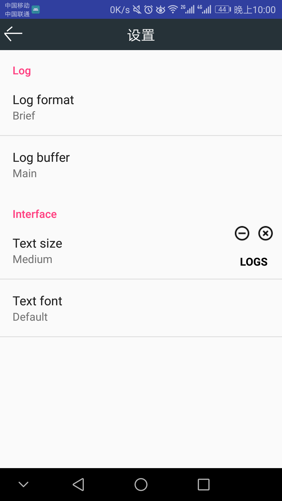
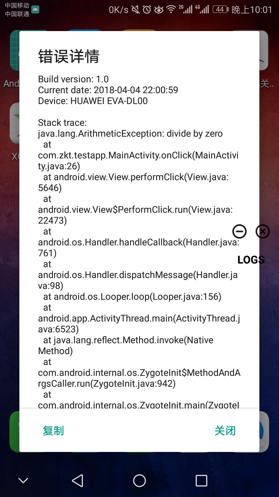

# AndroidTestTool

这是一个安卓测试工具,可以查看App运行过程中输出的日志，并且可以对日志进行筛选和选择复制。当发生崩溃时，会对异常进行捕获并弹出错误日志窗口，你可以进行复制或上传至服务器等操作。

### 预览
   
   
   

###使用说明
Gradle：
compile 'com.zkt:testtool:1.0.0'

Maven：
<dependency>
  <groupId>com.zkt</groupId>
  <artifactId>testtool</artifactId>
  <version>1.0.0</version>
  <type>pom</type>
</dependency>

### [下载Demo](https://fir.im/androidtesttool)

## 参考

* https://github.com/bamsbamx/UltimateLogcat
* https://github.com/Ereza/CustomActivityOnCrash
* https://github.com/fatangare/LogcatViewer

